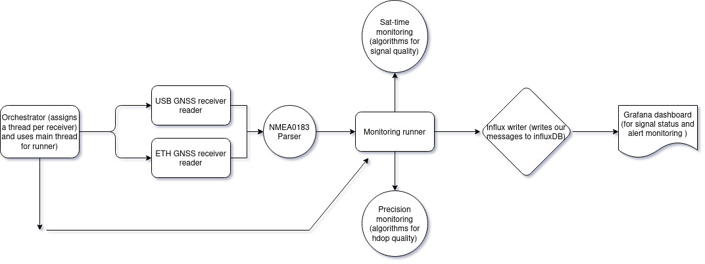

This project reads GNSS data from two sources. One from a simple USB port broadcasting NMEA0183 data, and one straight from the CAN-bus broadcasting NMEA2000 encrypted data using a Rasberry Pi with a PICAN -M NMEA2000 HAT.

The premise is that the more low-grade receiver shows signs of jamming and signal quality degradation before the main one, warning and giving the user plenty of time to switch to other marine navigation approaches if needed.

The data from the USB port gets used as is with minimal processing, where the data from the CAN bus is decoded with self-built decoders prioritizing latency and not needing to rely on third party providers.
The messages are then matched through a synced state cache and ran through different scripts containing anomaly detection logic.
The data along with the possible detected alerts gets written to InfluxDB and then displayed on real-time Grafana dashboards.

===========================================================================================================================================================================================================

Physical system components:

Raspberry Pi + CAN bus reader & NMEA 2000 HAT

Raymarine RS150 + barebones USB GNSS receiver (Model unknown) 

12V / 7.0Ah Battery for powering the system  + Separate power source for Rasberry Pi

[ Additional components include custom wiring, NMEA2000 splitter + other miscellaneous parts ]

===========================================================================================================================================================================================================

If you have the hardware side set up this is how you setup and start the software:

1. Create your .env file and attach credentials (example .env file in codebase).
2. Install requirements.txt
3. Run the start_services.sh script which starts the docker containers among the main program and services.
4. Log into localhost:8086 and get your influx token, paste this into the .env file.
5. Create your influxdb bucket and your grafana dashboard.
6. Now using the stop_script.sh and the start_script.sh again you should have a fully working system that takes in data from both sources, processed them, writes them to the database and ultimately displays the data.

===========================================================================================================================================================================================================

===========================================================================================================================================================================================================

Orchestrator: Creates 2 extra threads, assigns them to read 1 source of GNSS data per thread. Uses main thread to run monitor loop.

Receivers: Uses libraries to read data straight from our USB receiver. For the other receiver we are tapping straight into the CAN-Bus and manually decoding packets and harvesting wanted information. This information gets reconstructed to NMEA0183 messages from the NMEA2000 data.

Monitoring_runner:

A loop which is the core of the program. It takes in messages from the receivers and runs them through sat-time monitoring and precision monitoring functions. And then calls the influx writer to push the metrics.

Sat-time_monitoring:

A detection script that monitors and classifies issues, checking for problems like time jumps, impossible movement, satellite amount, signal timeout etc.

Precision_monitoring:

A detection script that monitors and classifies issues with HDOP. Check for things like straight up HDOP degradation or degradation trends.

Helper_scripts:

A collection of scripts related to parsing GGA messages, reconstructing NMEA0183 and decoding NMEA2000 messages.

Influx_writer:

A pretty run of the mill program that writes all of our metrics to influxDB.

Grafana dashboard:

This pulls from our influxDB bucket and displays all the wanted info on a realtime dashboard.

All of the microservices run in docker containers!

